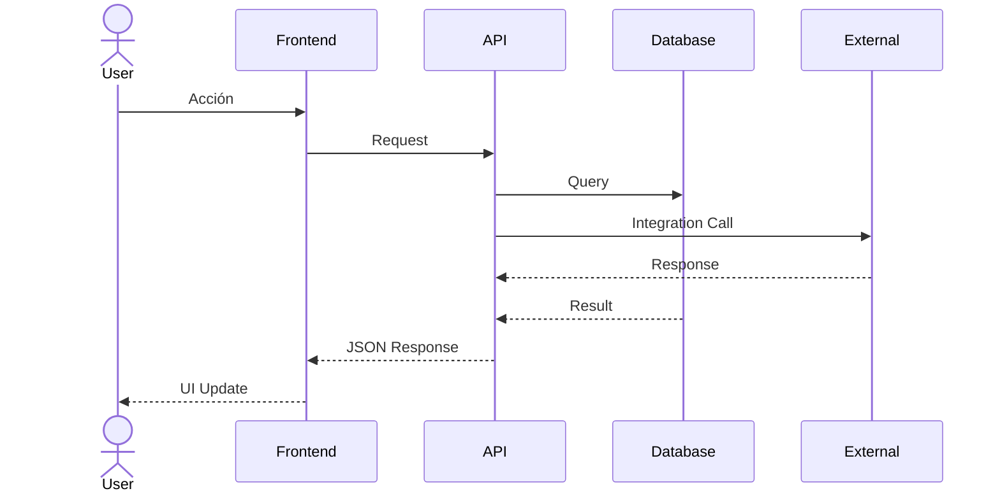

# Macro-Arquitectura y Definición Estructural del Sistema

## 1. Justificación y Objetivos de la Implementación

El presente ecosistema de software se diseña como respuesta directa al diagnóstico de brechas productivas identificado en la Fase 1. El objetivo fundacional es [DESCRIBIR EL OBJETIVO PRINCIPAL].

### Indicadores de Éxito Financiero (Auditoría ProInnóvate)

- [Indicador 1: Ej. Incremento del 30% en ventas digitales al término del décimo mes de ejecución].
- [Indicador 2: Ej. Erradicación absoluta de las discrepancias de inventario derivadas de transcripciones manuales al término del décimo mes de ejecución].

## 2. Fronteras de Dominio y Módulos Aislados

La arquitectura lógica del sistema se restringe estrictamente a los siguientes módulos de negocio. La generación de código y la orquestación de servicios deben respetar esta separación de responsabilidades para asegurar la mantenibilidad a largo plazo:

1. **[Módulo 1: Ej. Gestión de Inventario y Almacenes]:** Entidad responsable del control de ingresos, salidas, movimientos inter-almacén, cálculo de stock dinámico y valorización.

2. **[Módulo 2: Ej. Ventas y Facturación Electrónica]:** Motor transaccional para la creación de órdenes, emisión de comprobantes de pago, generación de estructuras XML y comunicación con la entidad recaudadora.

3. **[Módulo 3: Ej. Dashboard y Reportes]:** Subsistema de lectura diseñado para la agregación de datos operativos y visualización de Indicadores Clave de Rendimiento (KPIs) en tiempo real.

## 3. Matriz de Control de Acceso Basado en Roles (RBAC)

Las políticas de autorización, los middlewares de enrutamiento y la segregación de interfaces de usuario deben derivarse algorítmicamente de la siguiente matriz de permisos:

| Rol | Descripción | Permisos |
|-----|-------------|----------|
| ADMIN | Administrador del sistema | Acceso total a todos los módulos |
| GERENTE | Gerente de la empresa | Lectura completa + reportes |
| OPERARIO | Operario de almacén | Gestión de inventario |
| VENDEDOR | Personal de ventas | Ventas y facturación |
| CLIENTE | Cliente externo (opcional) | Solo compras |

## 4. Ecosistema de Integraciones y Dependencias Externas

La arquitectura exige la comunicación asíncrona y segura con los siguientes proveedores de servicios externos, requiriendo implementaciones robustas de resiliencia (patrones Circuit Breaker) y gestión criptográfica de secretos:

- **[Integración Externa 1: Ej. SUNAT/Facturación Electrónica]:** Flujo de autorización mediante tokens estándar OAuth 2.0. Requiere manejo de webhooks para confirmaciones asíncronas de transacciones.

- **[Integración Externa 2: Ej. Pasarela de Pago (Culqi/PayPal)]:** Consumo de servicios web basados en SOAP/REST para validación de comprobantes. Exige almacenamiento encriptado y rotación de certificados digitales de la empresa.

- **[Integración Externa 3: Ej. Proveedor de Almacenamiento en Nube]:** Uso de repositorios de objetos (S3 o equivalentes) para la persistencia de imágenes de catálogo y archivos documentales exportados.

## 5. Restricciones Técnicas

| Restricción | Detalle |
|-------------|---------|
| Presupuesto máximo | S/ 40,000 (recursos no reembolsables) |
| Plazo máximo | 10 meses de ejecución |
| Tecnología | Stack definido en AGENTS.md |
| Cumplimiento | Normativas de protección de datos personales |

## 6. Diagramas de Arquitectura

### Topología de Infraestructura (Mermaid.js)

### Flujo de Transacciones Principales

