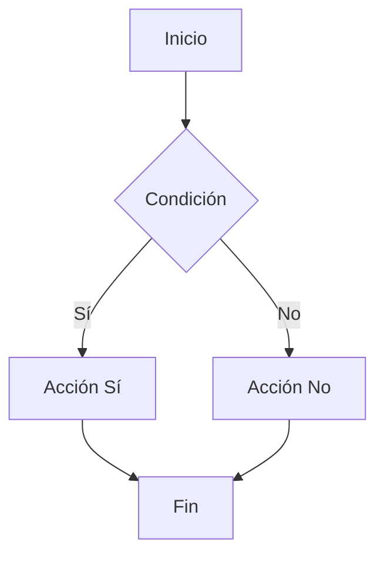

# Especificación Atómica: [TÍTULO DE LA HISTORIA]

## 1. Narrativa de Valor del Negocio

Como **[Actor Específico, ej: Operario de Almacén en turno rotativo]**

Quiero **[Funcionalidad Exacta, ej: acceder al terminal móvil mediante un teclado numérico optimizado (PIN) de 4 a 6 dígitos]**

Para **[Impacto en el Negocio, ej: registrar transacciones de almacén de manera expedita sin remover el equipo de protección personal ni escribir contraseñas alfanuméricas complejas]**.

## 2. Criterios de Aceptación (Verificación BDD)

> **Directiva de Agente:** Generar los casos de prueba unitarios (TDD) para las siguientes aserciones. Tras la validación en el entorno de pruebas local de los interceptores y controladores, modificar este archivo mutando los corchetes a estado completo (`[x]`).

- [ ] **[Criterio 1]:** [Descripción del criterio de aceptación verificable]

- [ ] **[Criterio 2]:** [Descripción del criterio de aceptación verificable]

- [ ] **[Criterio 3]:** [Descripción del criterio de aceptación verificable]

- [ ] **[Criterio 4]:** [Descripción del criterio de aceptación verificable]

## 3. Manejo de Excepciones y Casos Límite (Edge Cases)

El código de implementación debe prever y resolver los siguientes vectores de error operacionales:

- **Escenario 1:** [Ej. Latencia o Desconexión de Red]
  - En caso de [condición de error], el sistema debe [comportamiento esperado].

- **Escenario 2:** [Ej. Datos inválidos]
  - El sistema debe [comportamiento esperado] al recibir [entrada inválida].

- **Escenario 3:** [Ej. Concurrencia]
  - El sistema debe manejar [condición de carrera] mediante [estrategia de resolución].

## 4. Requerimientos Estructurales de Datos

Modificaciones necesarias a inyectar en los esquemas de bases de datos relacionales (Prisma/TypeORM):

- **Entidad Afectada:** [Nombre de la tabla/entidad]
- **Mutación de Esquema:**
  - `[Campo 1]: [Tipo]` - [Descripción del campo]
  - `[Campo 2]: [Tipo]` - [Descripción del campo]

## 5. Criterios No Funcionales

| Criterio | Requisito |
|----------|-----------|
| Rendimiento | [Tiempo máximo de respuesta] |
| Disponibilidad | [Porcentaje uptime] |
| Seguridad | [Requisitos de seguridad] |
| Compatibilidad | [Navegadores/dispositivos] |

## 6. Diagramas de Flujo (Opcional)

## 7. Tareas Técnicas Relacionadas

- [ ] [Tarea técnica 1]
- [ ] [Tarea técnica 2]
- [ ] [Tarea técnica 3]

---

**Estado:** [Pendiente | En Progreso | Completado | Bloqueado]
**Asignado a:** [Nombre del desarrollador]
